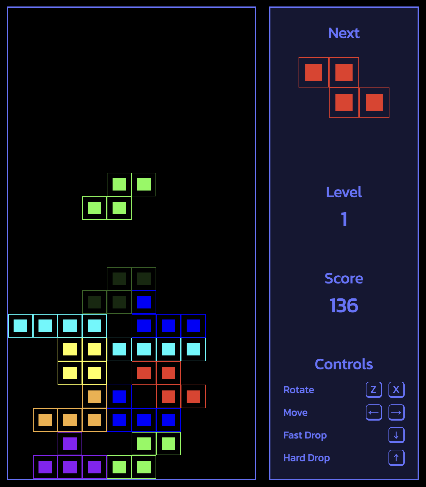

# React Tetris

Tetris game made on React + NextJS + Typescript as a practice.

:exclamation: It works only on desktop for the moment. :exclamation:

## Try it

https://react-tetris-alpha.vercel.app/

## Preview

## Code

Key files:

> src/hooks/useTetris.tsx

Custom hook that provides the interface to get the current game state and the methods to interact with the game.

> src/helpers/tetris.logic.ts

File with core tetris logic functions. Some logic was based on https://tetris.fandom.com/

## Features

- 15 levels
- Fast and Hard drop
- Tetromino placement preview
- Wall-kicks
- SFX and BGM
- Simplified score system (doesn't take T-Spins into account, insanely complex and too lazy to implement)